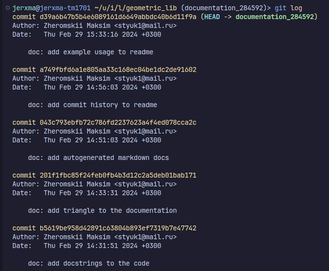

# Math formulas
## Area
- Circle: S = πR²
- Rectangle: S = ab
- Square: S = a²
- Triangle: S = ah/2

## Perimeter
- Circle: P = 2πR
- Rectangle: P = 2a + 2b
- Square: P = 4a
- Triangle: P = a + b + c


# Extra
## Example usage
### Cirle
```
>>> from circle import area, perimeter
>>> area(1)
3.141592653589793
>>> area(3)
28.274333882308138
>>> perimeter(1)
6.283185307179586
>>> perimeter(2.5)
15.707963267948966
```
### Triangle
```
>>> from triangle import area, perimeter
>>> area(6, 5.19615242271) 
15.58845726813
>>> perimeter(2, 3, 9)
14
```

## Git commit history
